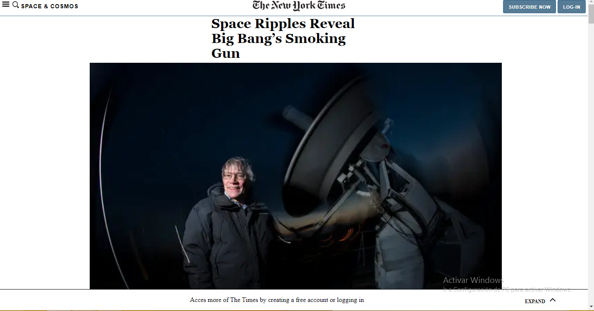
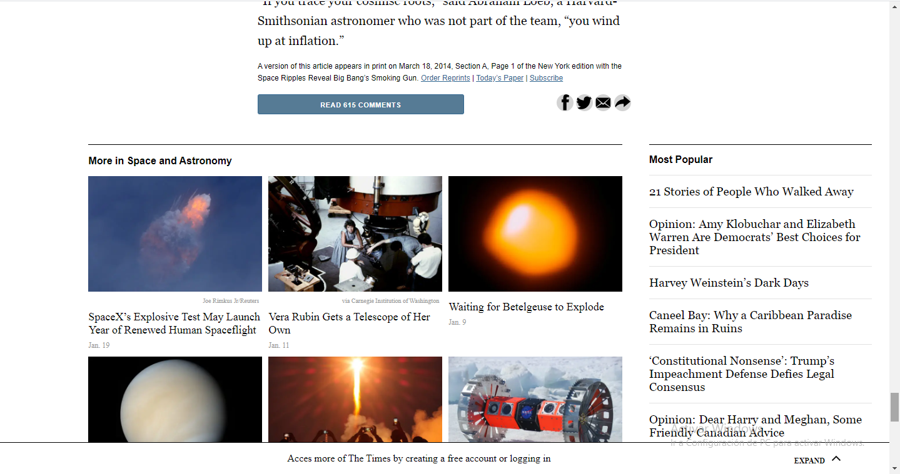

# Positioning-and-Floating-Elements
This is the third project of the Microverse HTML and CSS Curriculum. The project consists of a clone of one article of the New York Times web page.

## Screenshots

## Live Demo
https://raw.githack.com/Blasco9/Positioning-and-Floating-Elements/development/index.html

## Built with
- HTML5
- CSS3
- Used float for alignment

## Authors
This project was created by [abcussi](https://github.com/abcussi) and [Blasco9](https://github.com/Blasco9)
